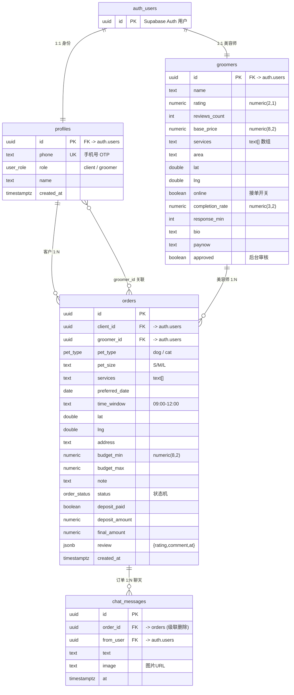

# PawGo 数据库 ER 图

上门宠物美容匹配平台 MVP · Supabase (PostgreSQL)

## 关系说明

| 关系 | 基数 | 说明 |
|------|------|------|
| auth.users ↔ profiles | 1:1 | 每个登录账号对应一个身份档案 |
| auth.users ↔ groomers | 1:1 | 美容师账号扩展资料 |
| profiles(客户) → orders | 1:N | 一个客户可下多单 |
| groomers → orders | 1:N | 一个美容师可接多单 |
| orders → chat_messages | 1:N | 每单一段临时聊天记录 |
| orders.groomer_id ↔ profiles | N:1 | 接单的美容师 |

## 关键约束

- **order_status 枚举状态机**：`matching → awaiting_deposit → confirmed → in_progress → completed / cancelled`
- **RLS 强制聊天隐私**：`chat_messages` 仅当 `orders.status ∈ (confirmed, in_progress)` 时可 INSERT
- **匹配硬过滤**：`groomers.services @> orders.services` + 距离 ≤ 12km + `online = true`
