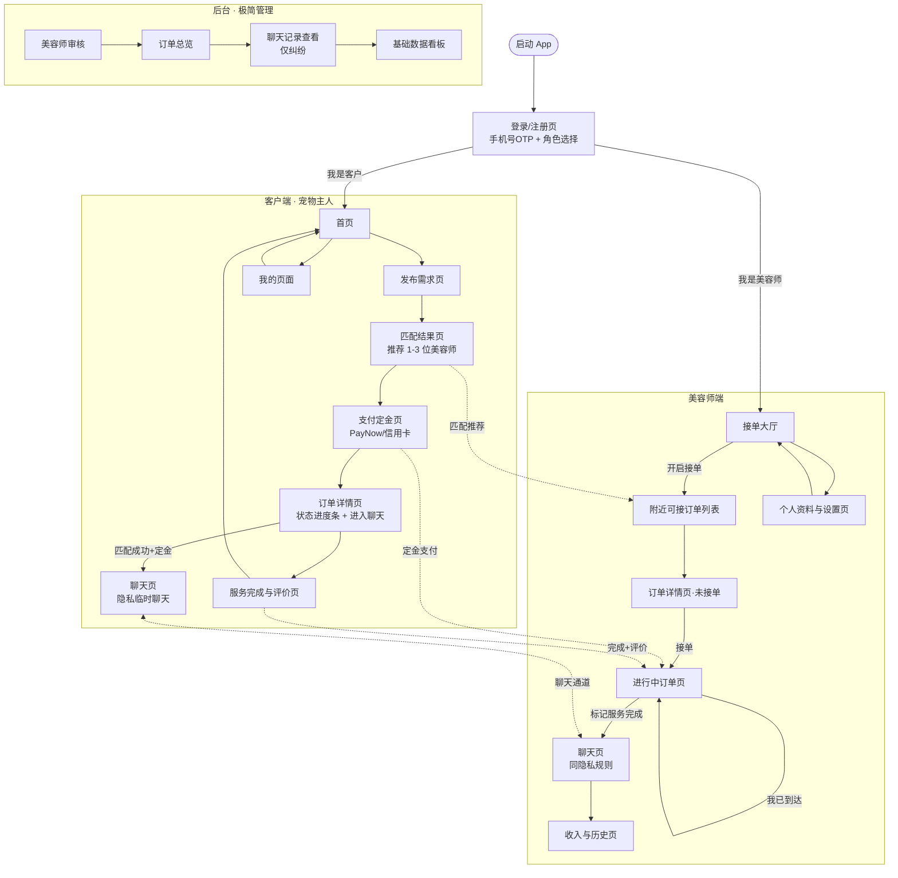
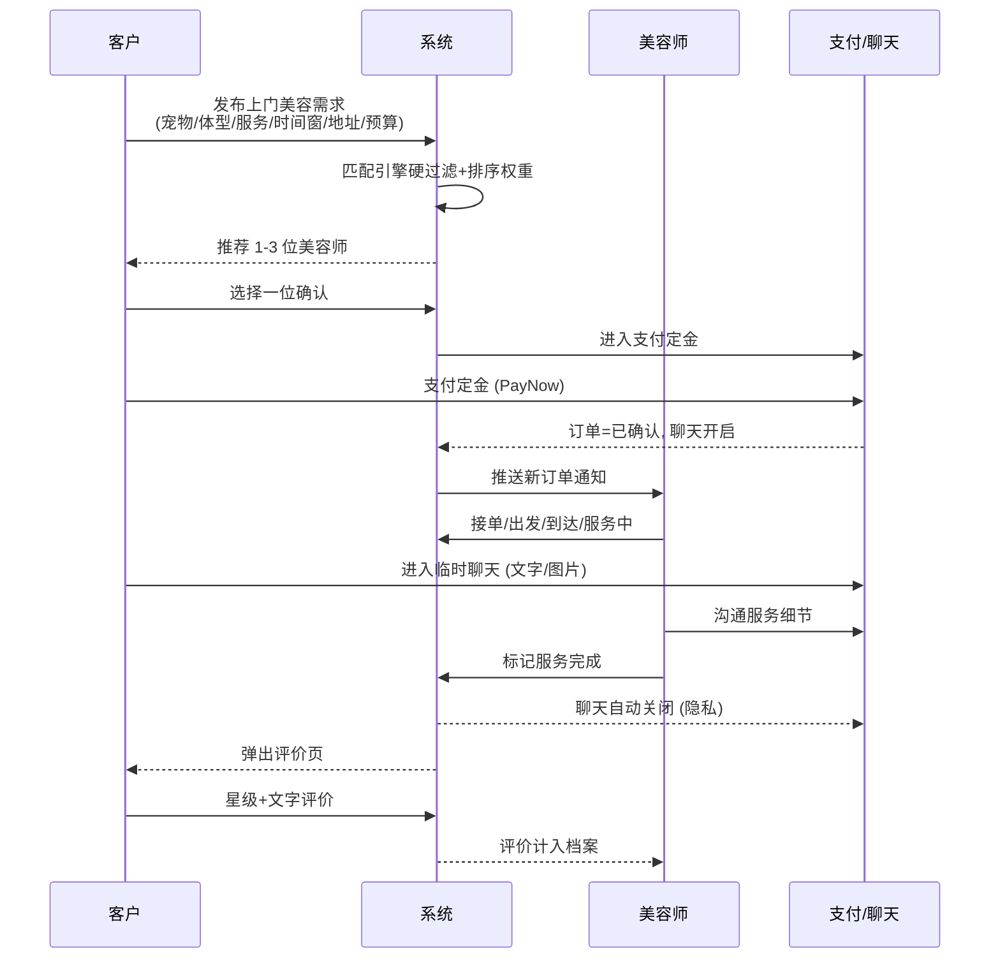

# PawGo 完整页面流程图

上门宠物美容匹配平台 MVP · 三端页面流转（客户 / 美容师 / 后台）

## 一、总览：三端页面地图

## 二、客户端主闭环（时序/泳道）

## 三、订单状态机 × 页面映射

| 状态 | 触发动作 | 客户端可见页 | 美容师可见页 | 聊天 |
|------|----------|--------------|--------------|------|
| `matching` | 提交需求 | 匹配结果页 | 接单大厅(列表中) | 关闭 |
| `awaiting_deposit` | 客户选美容师 | 支付定金页 | (待接单) | 关闭 |
| `confirmed` | 定金支付 | 订单详情+聊天入口 | 进行中订单 | **开启** |
| `in_progress` | 美容师出发/到达 | 订单详情+聊天 | 进行中(状态操作) | **开启** |
| `completed` | 标记完成 | 评价页 | 收入历史 | 自动关闭 |
| `cancelled` | 取消规则 | 我的/历史 | 进行中 | 关闭 |

## 四、关键设计原则（来自计划书）

- **大按钮、少步骤、一眼能懂**：每页单一主行动
- **极简**：MVP 只做匹配闭环，不做遛狗/陪伴
- **隐私优先**：聊天仅在「匹配成功+定金」后开启，完成后自动关闭，不暴露真实手机号/完整地址
- **双向选择**：系统推荐 3 个最优 + 客户自主选择
